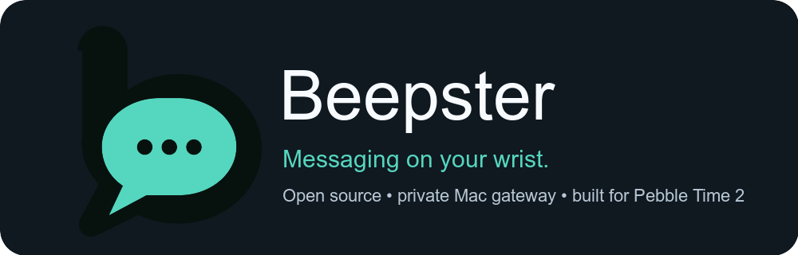

# Beepster



Beepster is a readable, reliable, open-source Beeper client for Pebble Time 2. It brings recent
chats, complete message text, voice dictation, saved replies, themes, emoji fallbacks, and inline
photo previews to the watch without putting a Beeper credential on the watch or phone.

Version 0.9.0 is the public-release candidate. The self-contained Mac Connector and watch app are
being prepared for signed release; the Pebble Store listing is still awaiting publication.

## What you need

- A Pebble Time 2 (`emery`) paired with the Pebble mobile app
- A Mac that can remain online with Beeper Desktop running
- Tailscale on the Mac and phone, signed into the same private tailnet
- A dedicated Beeper Desktop API access token

No iMessage bridge such as `imsg` is required. Beeper Desktop supplies the supported messaging
networks; iMessage itself requires Beeper Desktop to run on macOS. The release Connector bundles
its gateway runtime, so end users do not need Terminal, Git, Node.js, or developer tools.

## Start here

- [Install Beepster](docs/INSTALL.md) — complete Mac, Tailscale, watch, and pairing walkthrough
- [Use Beepster](docs/USER_GUIDE.md) — controls, replies, themes, media, and limitations
- [Troubleshoot](docs/TROUBLESHOOTING.md) — symptom-based fixes and the private health checker
- [Privacy](PRIVACY.md) and [security model](SECURITY.md)
- [Contribute](CONTRIBUTING.md)

## Current capabilities

- Cursor-paginated access to the complete selected Beeper inboxes through a 30-chat rolling watch
  window, with persistent pinning, contact and sender-name normalization, and service icons
- Automatic linking of split Apple email/phone chats matched to one Mac Contacts record, with a
  user-controlled alias fallback
- Persistent service filtering, with all networks enabled by default
- Chronological history that opens on the newest message and pages up to 60 messages
- Complete in-thread message text with configurable one-to-eight-line scrolling
- Fully configurable press and hold actions for all three buttons in both inbox and chat views
- Voice dictation with confirmation and delivery tracking
- Up to eight text-or-emoji quick replies
- Static photo, GIF-poster, and video-poster previews, including Instagram media
- HTML cleanup for rich Instagram messages
- Six presets and saved custom themes using five font families and five sizes
- Pebble-native emoji where possible, with readable text fallbacks elsewhere
- Explicit setup, loading, empty, timeout, offline, and retry states
- Self-contained, Keychain-backed Mac Connector with guided install, permissions, private setup,
  readiness checks, and idempotent reply transport

Animated GIF playback and multiple attachments per message remain planned. See the
[roadmap](ROADMAP.md) and [UX requirements](docs/UX_REQUIREMENTS.md).

## Architecture

```text
Pebble watch (C)
    ⇅ AppMessage
PebbleKit JS on phone
    ⇅ private HTTPS with a narrow Beepster gateway credential
Beepster gateway on Mac
    ⇅ localhost with the Beeper Desktop token
Beeper Desktop API
```

The Mac gateway resolves contacts, sanitizes rich text, resizes media, tracks delivery, caches safe
fallbacks, and keeps the Beeper token in the macOS Keychain. The phone is a transport adapter; the
watch owns presentation and interaction state. See [Architecture](docs/ARCHITECTURE.md).

## Development

Requirements: macOS, Pebble SDK 4.33.1 or newer, Pebble Tool 5, and Node.js 20 or newer.

```sh
npm test
npm run build
npm run check
```

`npm run check` runs JavaScript syntax checks, the gateway/transport test suite, a credential scan, and a
complete Emery build. Personal builds are ignored by Git because they contain a private settings
URL. Release packaging instructions are in [Publishing](docs/PUBLISHING.md).

## Independence and license

Beepster is an independent community project. It is not affiliated with, endorsed by, or sponsored
by Beeper, Automattic, Pebble, or Core Devices. Beeper and Pebble are trademarks of their respective
owners and are used only to describe compatibility.

The complete watch, phone, gateway, setup page, and artwork source is available under the MIT
license. Bundled fonts retain their SIL Open Font License texts in `resources/fonts/licenses`.
